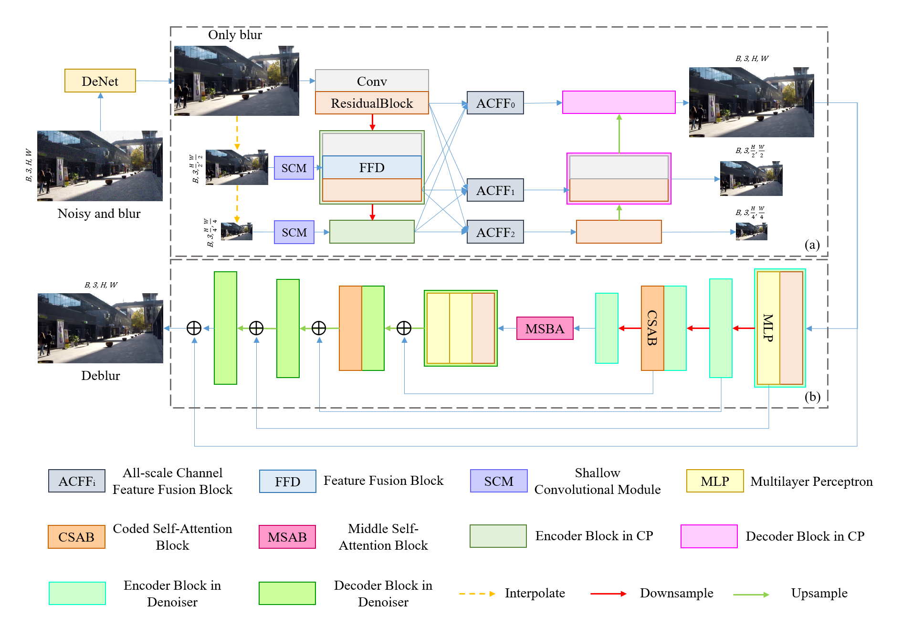

# CTFD
Pytorch Implementation of "[CTFD: Integrating CNN and Transformer with Diffusion Models for Robust Image Deblurring and Denoising](https://arxiv.org/abs/2204.04627)"

## Abstract
Image deblurring remains a challenging task in computer vision, particularly in complex scenarios involving motion blur and noise. In this paper, we propose CTFD, a novel deblurring network that integrates CNN and Transformer architectures within a diffusion model framework. Our approach utilizes a multi-scale CNN as an initial deblurring module, followed by a Transformer with an Inter-Intra attention mechanism as the diffusion model's reverse denoising module. This design enhances the initial deblurring results with finer details. To further improve robustness, especially against noise, we incorporate an auxiliary convolutional module, DeNet. Extensive experiments on various blur datasets demonstrate that CTFD outperforms classical and traditional deblurring methods, effectively addressing dynamic deblurring in noisy environments. The integration of CNN, Transformer, and diffusion models in CTFD showcases the adaptability and complementarity of these architectures, yielding superior image restoration results."

## Datasets
Download "[GoPro](https://drive.google.com/drive/folders/1BdV2l7A5MRXLWszGonMxR88eV27geb_n?usp=sharing)" dataset or "Hide" datasets into './datasets' and adjust the datasets path  
For example: './datasets/GoPro/train/1.png'  
For example: './datasets/Hide/test/1.png'  
Use the "trainer_onRealBlur.py" file when testing the RealBlur datasets

## Requirements
The model requires the following additional data bags
